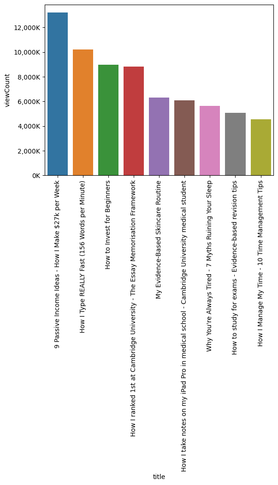

# Youtube-API-Analysis
## Overview
This project utilizes the YouTube Data API to gather and analyze statistics for a given set of YouTube channels and their videos. The primary goal is to perform exploratory data analysis (EDA) on the video data, including visualizations of key metrics and insights.

## Project Structure

### Data Collection

The project utilizes the YouTube Data API to retrieve channel and video data.

### Data Pre-processing

The retrieved data undergoes cleaning and transformation to facilitate analysis. This includes checking for NULL values, converting data types, and extracting additional features.

### Exploratory Data Analysis (EDA)

Various visualizations are created to analyze video performance, including:

- Bar plots for best and worst-performing videos
- Violin plots for view distribution per channel
- Scatter plots for views vs. likes/comments
- Histogram for video duration

### Wordcloud Analysis

A word cloud is generated from video titles, excluding common English stopwords, to visualize frequently occurring words.

### Upload Schedule Analysis

The project includes a bar plot showcasing the distribution of video uploads across different days of the week.

## Quick glance at the results

Best Performing Videos

Confusion matrix of gradient boosting classifier.

ROC curve of gradient boosting classifier.

